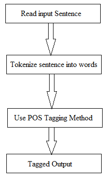

# PART OF SPEECH TAGGING

## Abstract —

In this project I create the part of speech tagger
using the basic probabilistic and hidden markov model. prob-
abilistic model is based on the calculate the N-Gram probability
for tags and probability that the tag is attach to the word.
In hidden markov model I used viterbi algorithm for tag the
sentence. for the implementation I use the penn tree bank 10%
data which is available at the nltk library. whole dataset(penn
tree bank) is not available for free so i use only 10% of that.

# 1. Introduction

Tagging is the process of tag the each word in sentence
corresponding to a particular part of speech tag, based on
its definition and context.
Part of speech tagging is very important in the Natural
language processing. In this project i make POS tagger for
the English language. I used the Probabilistic model and
Hidden markov model.

 

