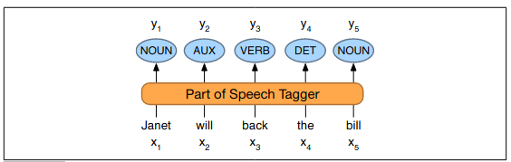
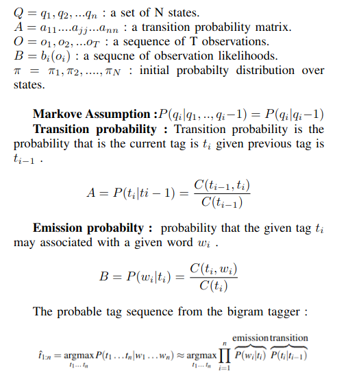
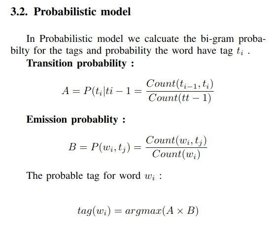

# PART OF SPEECH TAGGING

## Abstract —

In this project I create the part of speech tagger
using the basic probabilistic and hidden markov model. prob-
abilistic model is based on the calculate the N-Gram probability
for tags and probability that the tag is attach to the word.
In hidden markov model I used viterbi algorithm for tag the
sentence. for the implementation I use the penn tree bank 10%
data which is available at the nltk library. whole dataset(penn
tree bank) is not available for free so i use only 10% of that.

# 1. Introduction

Tagging is the process of tag the each word in sentence
corresponding to a particular part of speech tag, based on
its definition and context.
Part of speech tagging is very important in the Natural
language processing. In this project i make POS tagger for
the English language. I used the Probabilistic model and
Hidden markov model.

Fig. 1. Part of speech flow chart

An Hidden morkov model is a probabilistic sequence
model given a sequence of units. It calculate the probability
distribution over possible sequence of labels and chooses
the best sequence.

## 1.1. Motivation

Part of speech tags gives information about words in
language. Tag to the word also gives info about the word
and its neighbors. Part of speech tagging have application in
various tasks such as Information retrieval, parsing, Text to
Speech, semantics analysis, language translation and many
more. There is almost all the application of NLP required
Part of speech tagging as the sub task.

# 2. State of the art/Background

2.1. TnT – A Statistical Part-of-Speech Tagger [ 1 ]
Trigrams’n’Tags (TnT) is an efficient statistical part-of-
speech tagger based on the Hidden markov model. Hidden
markov models performs as well as the other current ap-
proaches, including the maximum entropy framework.
They use the

|Penn Tree Bank dataset|Accuracy|
|----|------------|  
|known words | 97.0 %|
|unknown words|85.5 %|
|overall|96.7 %|

Table 1: Accuracy for the TnT model

## 2.2. SVMTool: A general POS tagger generator based on Support Vector Machines

The SVMtool is a simple part-of-speech tagger based on
Support Vector Machines.
They used the fellowing feature for the svm training and
testing. word feature, POS feature, ambiguity classes, word
bigrams, POS bigrams, word trigrams, POS trigrams, sen-
tence info, prefixes, suffixes, binary word features, word
length.

|type|TnT|SVMTools|
|----|-------|-----|  
|known acc.|97.0 %|98.08 %|
|unknown acc.|95.5 %|88.28 %|
|overall acc.|96.7 %|96.89 %|

Table 2: Comparision of the SVMTools with the TnT

# Proposed Model

## 3.1. Hidden markov model

3.1.1. Introduction. An Hidden Markov Model (HHM) is a
probabilistic sequence model, given a sequence of words it
computes a probability distribution over possible sequence
of labels and choose the best label sequence.
The HMM is based on the Markov chain. The markov
chains make the assumption that the if we want to predict
the future state in the sequence. we only need the current
state.
Given the figure show we have sequence of words and
our model gives the sequence of output tags.

Fig. 2. The Task of POS tagger is mapping input words
w 1 , w 2 , ...w n to POS tags t 1 , t 2 , ....t n

## 3.1.2. Dataset

We used the Penn tree bank dataset and penn
TreeBank part-of-speech tags. following is list of sample
Penn tree bank tagset list. full list can be found at their
website.

|Tag|Description|Example|
|--|---|--|
CC|coord. conj.|and, but, or
CD|cardinal number|one, two, 5
DT|determiner|a, an, the
IN|preposition|of, in, by
JJ|adjective|yellow, good
NNP|proper noun|IBM
RB|adverb |quickly
verb |base|eat

> Table 4: Sample tagset and there Discription
List of all the 46 tags used :
[’NNP’, ’,’, ’CD’, ’NNS’, ’JJ’, ’MD’, ’VB’, ’DT’, ’NN’,
’IN’, ’.’, ’VBZ’, ’VBG’, ’CC’, ’VBD’, ’VBN’, ’-NONE-’,
’RB’, ’TO’, ’PRP’, ’RBR’, ’WDT’, ’VBP’, ’RP’, ’PRP\$’,
’JJS’, ’POS’, ’“’, ’EX’, ”””, ’WP’, ’:’, ’JJR’, ’WRB’, ’\$’,
’NNPS’, ’WP\$’, ’-LRB-’, ’-RRB-’, ’PDT’, ’RBS’, ’FW’,
’UH’, ’SYM’, ’LS’, ’’].

# Results

Accuracy :
Accuracy = Total correct words tagged / total words
tagged
Probabilistic model gives around 87.5 % accuracy on
sample test data.
HHM based model gives around 51.3 % accuracy on
sample test data

# Conclusion & Future Work

I will try to rectify the Hidden markov model because it
is not giving accuracy as expected and add the name entity
recognition using Conditional random fields for the penn
tree bank dataset.

# References

1. T. Brants, “TnT – a statistical part-of-speech tagger,” in Sixth Applied
Natural Language Processing Conference. Seattle, Washington,
USA: Association for Computational Linguistics, Apr. 2000, pp.
224–231. [Online]. Available: <https://aclanthology.org/A00-1031>

2. J. Giménez and L. Màrquez, “SVMTool: A general POS tagger
generator based on support vector machines,” in Proceedings
of the Fourth International Conference on Language Resources
and Evaluation (LREC’04). Lisbon, Portugal: European Language
Resources Association (ELRA), May 2004. [Online]. Available:
<http://www.lrec-conf.org/proceedings/lrec2004/pdf/597.pdf>

3. M. Collins, “Discriminative training methods for hidden Markov
models: Theory and experiments with perceptron algorithms,” in
Proceedings of the 2002 Conference on Empirical Methods in
Natural Language Processing (EMNLP 2002). Association for
Computational Linguistics, Jul. 2002, pp. 1–8. [Online]. Available:
<https://aclanthology.org/W02-1001>
4. X. Ma and E. Hovy, “End-to-end sequence labeling via bi-
directional LSTM-CNNs-CRF,” in Proceedings of the 54th Annual
Meeting of the Association for Computational Linguistics (Volume
1: Long Papers). Berlin, Germany: Association for Computational
Linguistics, Aug. 2016, pp. 1064–1074. [Online]. Available: https:
//aclanthology.org/P16-1101
5. B. Plank, A. Søgaard, and Y. Goldberg, “Multilingual part-of-
speech tagging with bidirectional long short-term memory models
and auxiliary loss,” in Proceedings of the 54th Annual Meeting
of the Association for Computational Linguistics (Volume 2:
Short Papers). Berlin, Germany: Association for Computational
Linguistics, Aug. 2016, pp. 412–418. [Online]. Available: https:
//aclanthology.org/P16-2067
[6] D. Jurafsky and J. H. Martin, Speech and Language Processing (2nd
Edition). USA: Prentice-Hall, Inc., 2009.
